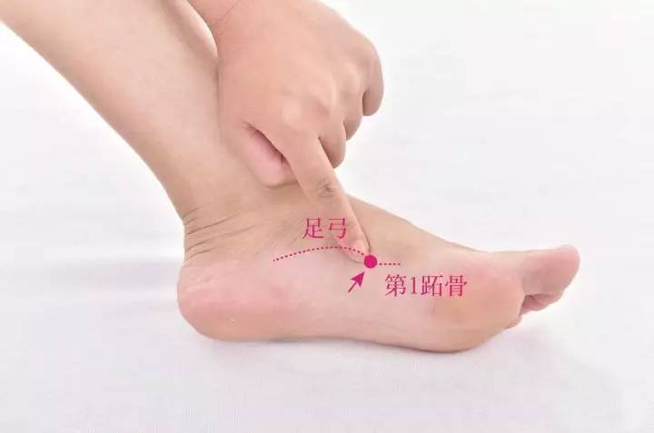
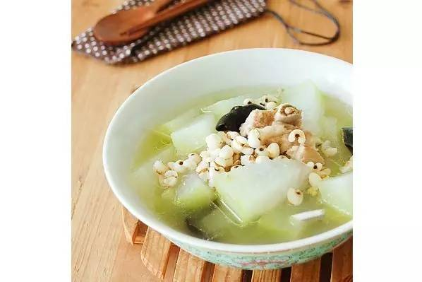

### [养好脾胃，还你一双没有眼袋的明眸](http://www.jianshu.com/p/0ddb5db8041c)

“瞬美目以流眄，含言笑而不分。”自古以来，我们对美人的要求，一定少不了一双清澈的眼睛。眼周紧致、肤色均匀，眼睛看上去就会神采奕奕，一颦一笑，都仿佛传递着动人的情绪；相反，`如果眼睛下挂着重重的眼袋，看上去就失去了神采，整张脸庞也显得黯淡而疲倦，没有精神气。`

对许多姑娘而言，眼袋是一个很顽固的敌人。有的姑娘比较幸运，只需要一个充足的睡眠就能摆脱烦恼；但大部分姑娘会发现，眼袋一旦出现，就很难消除，不论用什么样的护肤品，总是不见成效。这种情况下，`眼袋其实是身体给我们发出的信号，提醒我们注意健康了。`

`难以消除的眼袋，其实是脾胃作祟`

▼

`我们的下眼睑是属脾的`，在中医看来，眼周的问题其实和脾胃、肾脏虚弱有关，脾胃虚则眼袋大，肾虚则眼圈黑。

脾胃是负责运化的脏腑，负责把身体内的水湿运化排出体外。如果脾胃虚弱，水湿之气不能很好地被脾胃运化，顺畅地排出，就会滞留在我们的身体里。`而眼睑下方，正好是胃经起始的地方，水湿首先就会停在这里，淤结在眼睛周围，形成眼袋。`

在老家的时候，我发现在农村务农的姑娘脸上，很少出现眼袋。而大部分城里的姑娘，由于工作或学习的原因，平时总是保持着坐姿，缺乏运动。`中医认为“久坐伤肉”，而脾是主肉的，久坐不动的人，脾胃功能会比较虚弱`，再加上熬夜等不好的习惯，就更容易形成眼袋了。

所以，想要消除眼袋，我们就要养好脾胃，帮助身体祛除体内的水湿之气。

`先健脾胃，按这两个健脾穴位`

▼

公孙穴和四白穴，分别是我们脾经和胃经上的两个穴位，一个位于足部，一个位于脸部。被眼袋困扰的姑娘，平时可以多按揉一下这两个穴位，`能够帮助身体改善脾胃功能，增强眼周围的气血微循环`，从而减轻眼袋。

公孙穴

坐在椅子上，让两腿自然下垂着地，用手指沿着脚掌内侧边缘向后摸，摸到第一跖骨中部的凹陷处，也就是公孙穴所在的位置。

公孙穴不仅是我们脾经上的“排污口”，能够以水湿风气的形式，来运化脾经之气；它还是八脉交会穴。就是说，按摩公孙穴，不仅能刺激脾经，调理脾胃功能，还能刺激到我们的冲脉，而冲脉是总领我们全身气血的一条经脉，能改善周身气血循环，带走体内的水湿。水湿之气减少了，眼袋也会减轻很多。

方法

坐在椅子上，俯身用两手握住脚背，将两手拇指放在公孙穴处，用力按住不放，保持五分钟左右。

公孙穴每天按摩两次就足够了。我一般会在早上起床时，和晚上睡前按摩。按完以后，足部会有微微的酸胀感，尤其是晚上，按完后入睡会特别快。有了充足的睡眠，眼袋自然也没有侵扰的机会了~

四白穴

四白穴位于瞳孔正下方，距离眼睑下缘约一横指宽的距离。相信姑娘们对这个穴位都不陌生，小时候做眼保健操，其中一个动作就是按揉四白穴。四白穴，是胃经上距离眼部第二近的穴位，是影响眼周气血的关键穴位，经常按摩，能够帮助眼周活血化瘀，改善气血循环，减轻眼袋的症状。

方法

闭上双眼，将双手食指的指腹轻按在两侧四白穴处，稍稍用力的时候，会感到眼球受到轻微的压力。两只手指同时沿顺时针或逆时针的方向按揉四白穴8-12次，再沿相反方向，重复按揉共100次。

这个穴位按揉起来很方便，上班族平时面对屏幕，觉得眼睛疲劳的时候就可以随时随地按摩一下，帮助缓解眼部疲劳的同时，也能保养眼周的肌肤，让肌肤光洁均匀，神采奕奕。

再去湿气，喝薏米冬瓜祛湿汤

▼

马上快到夏季了，冬瓜是我家夏季餐桌上常备的一道菜，它利水湿的作用很好。《随息居饮食谱》记载冬瓜“`甘平。清热，养胃，生津……行水。`”我家最常做的，就是和薏米一起煲汤，既能健脾胃，又能祛水湿，而且大多数人都能喝，很适合作为夏天常喝的祛湿汤。

薏米是家喻户晓的祛湿食材，很多姑娘一定都喝过薏米红豆汤。薏`米入脾、胃、肺三条经络，它最难得的地方在于，不仅能健脾胃，专祛脾经、胃经的水湿，同时还有补肺的作用`。我们都知道“肺主皮毛”，所以补肺的食物对皮肤也好，能让我们眼部周围的皮肤更紧致。`薏米，几乎就是为了祛眼袋量身定制的食材~`

食材：薏米 30g，冬瓜 300g，姜 1块

做法：

1、提前2-3小时将薏米用清水浸泡透，同时用刀将生姜拍散备用。冬瓜洗净去皮后，用刀切成大块。`冬瓜容易煮烂，切大块，能更好地保持它原本的风味。`

2、在锅中放入冷水，加入拍散的姜和浸泡好的薏米，开大火将水煮沸，再转小火煮到薏米软烂。

3、放入冬瓜，继续小火炖煮十几分钟，到冬瓜变透明时关火起锅，放入少许盐调味，就可以喝啦~

这道汤里用到的食材都比较平和，除了孕妇，大多数体质的朋友都能放心喝。`其中只有薏米微寒，所以煲汤的时候放入了一块生姜来袪祛寒凉`，有时间的话，还可以加入猪骨一起煲1小时以上，冬瓜和薏米都煮得绵软，吸收了猪骨的香味儿，汤味会更鲜~

-End-

`总说眼睛是我们心灵的窗户，透露着我们内心的喜怒哀乐，可是眼袋的存在，就像给这扇窗户遮上了一道帘子。希望每个姑娘都能拥有一双明亮、精神的眼睛，也拥有健康的身体和良好的仪容`~
