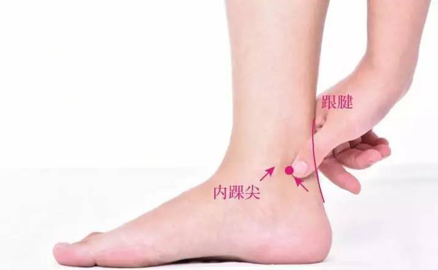
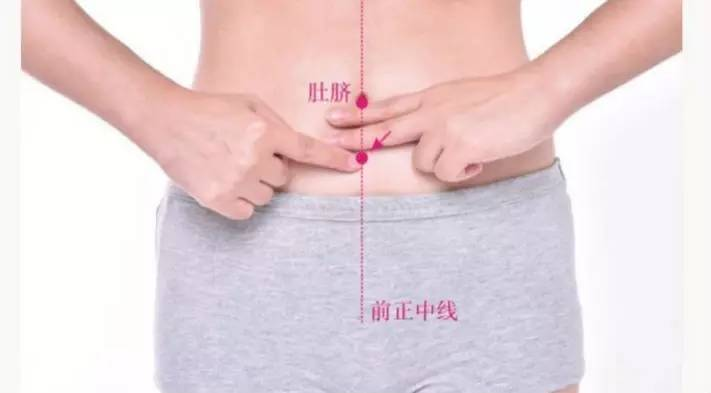
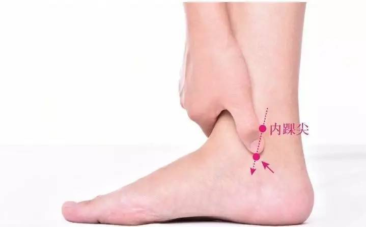

### [祛黑眼圈，可不止早睡早起那么简单](http://www.jianshu.com/p/546114f69c88)

`当我们和一个人见面的时候，最先会直视的便是对方的眼睛。一双清澈明亮，神采奕奕的明眸，总会给人留下一个好印象。`

所以女孩们随身携带的化妆品里，总少不了一盒遮瑕膏。除了遮痘痘，还要遮住我们的黑眼圈。脸上有黑眼圈的女孩儿，看起来总是有些憔悴，失去了神采。这样的姑娘，美则美矣，却总感觉少了那一丝鲜活的神韵。

我们使用的各种眼霜，虽然有一定的效果，但却很难彻底消除。黑眼圈归根到底，是身体对我们的一个小小提醒：该注意健康啦~

`长期不消的黑眼圈，和肾虚、淤血有关`

▼

中医有一句话，是说：眼袋大脾虚，眼袋黑肾虚。眼袋的问题，主要和我们的脾胃虚弱有关，而黑眼圈除了因为肾虚，和血淤也有关系。

怎么判断自己是肾虚还是血淤呢？可以观察一下脸上黑眼圈的位置，如果在眼下，多是肾虚；如果在眼周，多是血淤。

肾虚就是肾精不足，主要是由于长时间的熬夜、生活压力太大、作息不规律等等引起的。肾虚则两眼缺少精气的滋润，肾之黑色就浮于脸上，因此才会双目无神，眼圈发黑。这样的姑娘，除了眼睛下会有黑眼圈之外，平时还很怕冷，四肢冰凉，腰部酸痛无力，早上起床人会浮肿。

`这种类型的黑眼圈，因为是长期不良的生活习惯所导致的，比较深了。所以需要先慢慢调理身体，再节制生活，改变自己的生活习惯。`

还有一种血淤型黑眼圈，主要是因为体内有淤导致的。我们眼周的皮肤是非常薄的，甚至能隐隐看到里面的毛细血管。所以身体有淤堵的时候，便会在我们眼周的皮肤上显现出来。

有血淤型黑眼圈的姑娘，面色苍白，脸上会长出黑斑。另外月经量一般都比较少，同时带有黑色的血块，甚至会长期痛经。所以最重要的是赶紧帮助自己活血化瘀，把气血疏通了，自然黑眼圈也就渐渐消失了。

`肾虚型黑眼圈，可借助艾灸扶植阳气`

▼

说到肾虚，很多人会纠结自己是肾阴虚还是肾阳虚。这个时候，我建议大家可以用艾灸身上3个穴位，分别是太溪穴、关元穴还有照海穴。这些穴位都具有双向调节的作用，肾阴虚、肾阳虚的朋友都可以用来调理身体。

举一个例子吧，比如说我们身上的天枢穴，不管是腹泻还是便秘都可以进行艾灸，它能根据我们身体的情况，进行自我调节。所以我们的身体其实是一个非常奇妙的组织，如果能事先了解它，能帮我们省事很多。

·太溪穴·

太溪穴在我们内踝尖与跟腱之间的凹陷处。太溪穴这个名字的由来，是指肾经水液在此形成较大的溪水，艾灸这个穴位，既能滋阴益肾，又能壮阳强腰。

关元穴·

关元穴在我们小腹上，手掌并拢横放在脐下，以人体中线分，掌下正中点就是关元穴。艾灸关元穴，可以给身体补元气，促进气血流动，温暖下焦。

照海穴

照海穴在我们内踝尖下方凹陷处，照海穴在奇经八脉中属阴跷，与足少阴肾经交会，为八脉交会要穴之一，有滋肾清热、通调三焦之功，既补益又清热。

艾灸的顺序是关元穴、太溪穴、照海穴。每个穴位艾灸5~10分钟，1周艾灸2~3次就可以了。

`血淤型黑眼圈，坚持服用三七粉`

▼

如果是血淤的姑娘们，一定不要给自己吃很多生血的食物。这就好比疏通管道一样，一定要先把管道里淤积的东西清理了，才能确保它自然流通。如果不先疏通就一味的补，淤积得只会越来越严重。所以一定要先把身体里旧的血淤化掉了，再来补新血。

这种情况下，我建议可以每天服用两三克左右的三七粉。三七粉是很神奇的一味中药，它的主要作用是活血、止血，还能帮助我们补血。

《玉揪药解》说三七："凡产后、经期、跌打、痈肿，一切瘀血皆破；凡吐衄、崩漏、刀伤、箭射，一切新血皆止。"

《本草纲目拾遗》：“人参补气第一，三七补血第一，味同而功亦等，故称人参三七。”

如果你的体内有淤血，三七粉自然能帮助你化瘀；如果不小心受伤，身体出血，它又能帮我们止血；如果你血液亏虚，面色淡白，它又能帮我们补血。这样坚持服用三七粉一个月的时间，黑眼圈便会有明显的改善。

`不要忽视了，睡眠不足引起来的黑眼圈`

▼

最后还有一种黑眼圈，是因为长时间熬夜，睡眠不足所引起的。因为眼部血管无法休息，持续充血，最终引起了黑眼圈。不过这种黑眼圈不是很明显，若隐若现的，只要能保持充足的睡眠，就可以渐渐消失。

但不要因为这样，便觉得无所谓哦。因为脸上出现黑眼圈，代表睡眠不足已经非常严重了，这种情况下，如果你还坚持熬夜不休息的话，便会开始消耗肾精，黑眼圈也越来越严重，直到变成顽固型。到那个时候，就不好消除啦。

`所以从今天开始，就让自己睡一个充足的好觉吧，这是比吃什么药都管用的方法~让身体在睡眠中得到休息，早晨醒来，自然精神饱满，双眼明亮有神。`
