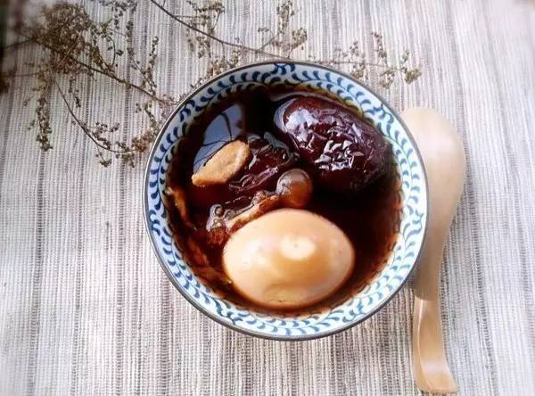
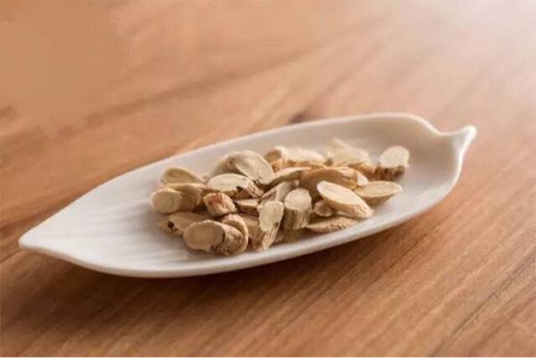
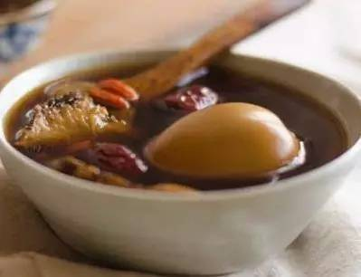
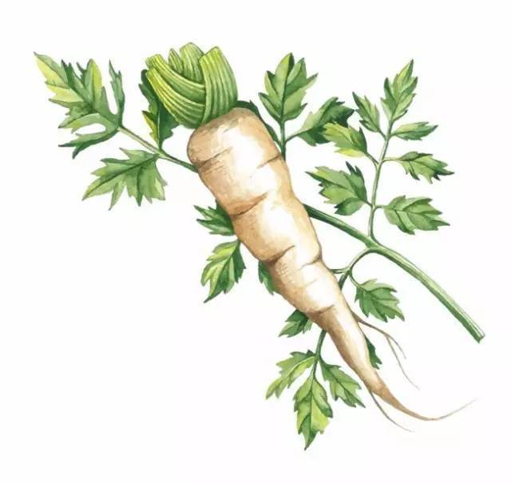

### [今日大雪，补足气血，过一个暖暖的冬天～](http://www.jianshu.com/p/233fb6391db5)

今天是大雪，身在南方的我也忍不住有些羡慕北方的朋友。一直认为，冬天若有雪才带着诗意，心里才会泛起“这才是冬天”的幸福感。

积阴为雪，至此栗烈而大矣。天地之间的阴气化为雪，纷纷落下，因而外面的阴气越来越重，而阳气则全部收敛于地下。`人也是一样，冬天的时候，阳气收敛藏在我们的五脏六腑之中，吃进来的食物更容易被吸收，是给身体进补的好时候。`

特别是大雪到冬至这15天，`天地间的阴气越发旺盛，阳气在体内封闭的也越发稳固`。古人将大雪所在的这一个月，称之为“畅月”，就是“充实之月”，会在这段时间抓紧给身体进补，以达到事半功倍的效果~

### 大雪进补，主要是补足气血

我们平时不管是清补还是大补，其实都是为了`让我们气血更加充盈。气和血都是生命的载体，在共同滋养我们的身体`。人的健康与气血息息相关，`当气血充盈的时候，营养吸收得好，毒素排得出，身体抗病抗寒能力也强，冬天不管再冷，手脚也是温暖的。`

姑娘们想要追求光泽细腻的皮肤，也要让我们的气血充足。气血不足，我们的皮肤就容易粗糙发暗，长斑，自愈的能力也会变弱。

当归黄芪蛋，给身体大补气血

补气血的方法，当属金元四大家之一的李东垣所创当归黄芪汤。不过这个汤阴虚的人不太适合，配上滋阴润燥的鸡蛋之后，基本上所有人都可以吃。

以前每年冬天，我妈妈就爱煮给我吃， 我小时候不是特别爱吃鸡蛋，会觉得有股腥气，但是和当归黄芪一起煮了之后，腥气就消失了，留下一股淡淡的中药香味。碗里再添一勺红糖，把鸡蛋裹的甜蜜蜜的。

`当归是血药之圣，补血活血的功效十分强。`中医讲“血药不容舍当归”，说到补血的东西一定会提到当归。凡是与血相关的病，不管是血虚，血热，血淤，都可以用到当归。

`而论补气，黄芪当属第一。`黄芪性温，味甘，入脾、肺二经，因此它提升脾肺之气的功效是最强的。像是平时身体比较虚弱，一动就出汗，肺活量比较小的朋友，最适合用黄芪来给身体补补中气了。

`经常吃当归黄芪蛋，在给身体大补气血的同时，又能活血化瘀，加快身体的自我修复过程，像是脸上长痘，长斑或是月经不调，淤血不尽，手脚冰凉的姑娘都可以吃黄芪当归蛋来调理自己的身体。`

食材：黄芪 50g 当归10g 鸡蛋1个 红糖 适量（黄芪与当归的比例为5:1）

做法：

1.锅里加适量的水，放入鸡蛋煮熟，加少许盐，可以防鸡蛋开裂。煮好的蛋去壳，用牙签在表面刺一些小孔。

2.将整只当归横切成薄皮，和黄芪一起放入锅中，加3碗水煮沸。

3.放入鸡蛋，大火煮沸后，小火炖，煮汤至一碗即可，约40分钟。

4.根据自己的口味，加入红糖，继续煮5分钟左右即可。

因为配了鸡蛋，所以每天早上吃是最好的。鸡蛋还有提气的作用，早上吃一个鸡蛋，一整天都会很有精神，身体也暖暖的，没有那么怕冷了。

### 不过需要注意，月经期间和高血压的朋友不能吃哦。

如果担心上火，怎么办？

有时候我们只要一提到补，很多朋友就会担心身体受不了，可能会上火。这种担心其实是对的，冬天的时候我们吃的食物大多都比较偏滋补，堆在胃里不好消化，这个时候再吃大补的食物，反倒更容易上火了。所以我一般会建议大家在`冬天再搭配吃一些白萝卜，清除体内的淤火，肺热，帮助身体更好的进补`。

`《本草纲目》中记载萝卜能：“大下气，消谷和中，利五脏，宽胸膈，化积滞，解酒毒，散瘀血。治反胃噎疾等。”
`
白萝卜生吃，熟吃都可以，从功效上来说，生吃更偏重于去火，熟吃更偏重于顺气。如果平时就很爱上火，可以生吃白萝卜，一般情况下，最好还是煮熟之后吃，生吃萝卜毕竟有些寒凉。

只要感觉自己上火了，或者在吃辛辣食物的时候，都可以切几片生萝卜来吃，去去火。直接把萝卜切成片摆在盘子里，白生生的，看起来就水嫩，咬一口带着一股辛辣和解气，唇齿之间十分畅意。

熟吃的话，最好可以和高汤一起煮。白萝卜放在高汤中，小火慢慢炖，注意不要炖的大开，把白萝卜的甘甜一点一点引出来，让汤变得温润，倒出来之前再撒一些盐提味就行了。滋补的食物吃的比较多，胃里不好消化，吃不下饭了，就可以喝点萝卜汤来消食下气。

白萝卜是属于整个冬天的食物，在进补的时候多吃一吃，帮助身体把一些多余的东西，比如淤火，肺热，或是一些不消化的食物给清一清，也是非常重要的一件事。

感谢大雪时凛冽的寒风和肆意的飘雪，我已经感受到，大地的温柔，其实就藏在最深的地方。
