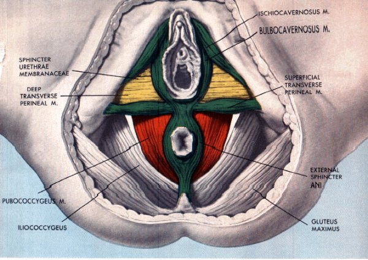

很多人都听过锻炼PC肌、耻骨尾骨肌、凯格尔运动、提肛运动等，其实都是一回事。PC肌又叫耻骨尾骨肌，PuboCoccygeus，准确的说是肌肉群。从身体前方的耻骨（pubo）开始，到身体后方的尾骨（coccygeus）

对男人来讲，锻炼PC肌有助勃起、延时、高潮乃至多重高潮。对女人而言，锻炼PC肌有助分娩、高潮等。总之，锻炼PC肌，对男女都大有好处。并且和其他肌肉一样，越锻炼越强壮，越锻炼越性福！

对早泄而言，PC肌相当于刹车，在射精冲动时及时刹住，从而延长时间。如果刹车系统不够有力，即使想刹车也刹不住。所以才需要锻炼！

先找到PC肌：小便的时候半路突然憋住，那块肌肉就是。如果憋尿很困难，说明PC肌很弱。找到PC肌之后，就可以锻炼了：先收缩3秒，然后放松3秒，如此反复，刚开始可以每天做个3、5分钟。然后慢慢延长时间，收缩5秒后放松5秒，慢慢提升到收缩10秒后放松10秒，同时结合呼吸训练，收缩时深深吸气，放松时呼气，可以感受到明显的放松和神经舒缓。每天保持5——10分钟，坚持一个月，会感受到自己的进步。

可以在任何时候锻炼PC肌，尤其等车、站地铁、开会等无聊时间，但是注意，有人锻炼PC肌过程中可能会勃起，所以注意遮挡，别大庭广众之下练着练着练勃起了……
