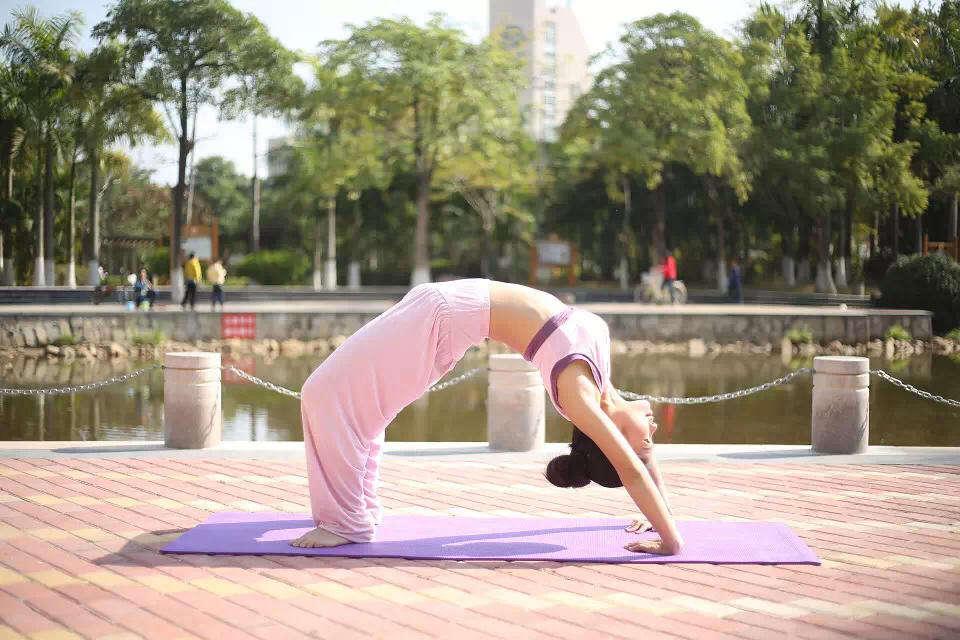
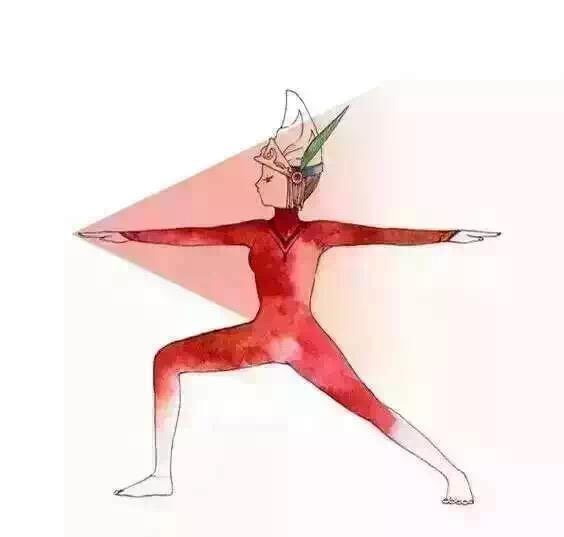
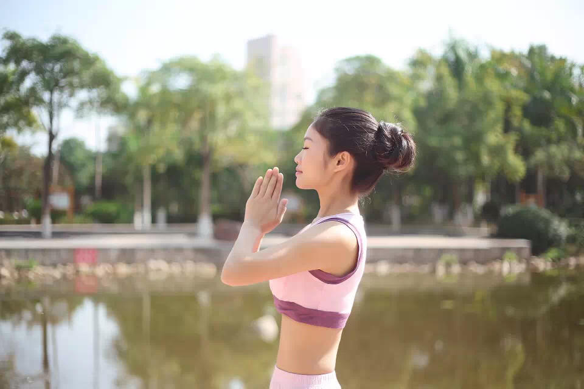

### [如何通过瑜伽体式调整情绪（二）](http://www.jianshu.com/p/170b5585b179)

我们的情绪并不是单一的类似悲伤、痛苦、抑郁等等，情感的有效表达、人体能量的补充甚至是脸部的表情都能影响到我们的情绪，以上三点也可以根据相对应的瑜伽体式进行改善。

`情感表达`：喉咙和下巴是我们表达情感的中心地带。如果一个人内心积聚的情感没有表达或者发泄出来，喉咙就会生病，最经常的表现就是久咳不愈。改善这一状况最佳的做法是多练习呼吸法，同时认真地去面对问题的实质，真诚地进行自我反省，想明白内心深处的真实想法然后试着恰当地表达出来。配合瑜伽体式当中的肩倒立、扩胸运动和轮式等都能有效的改善情况。

>轮式

`能量补充`：两脚底的涌泉穴就如同一双入口，每一天大地的能量通过双脚进入我们的身体，再通过大腿向上运往身体各处，所以有人把双脚比喻成身体的配电板，这就是为什么很多人喜欢做足底按摩。活动双脚、强化脚步力量的体式可以帮助促进全身能量的流动，当我们的身体稳稳地保持在中间，也便是“活在当下”的意义，如标准的山式站姿、幻椅式、战士二式等。

>战士二式

`脸部放松`：很多时候脸部表情是我们所有情绪的直接体现。微笑、悲伤或者是严肃古板，某一天或者是某个时期的表情并不会揭示出一个人内心的显著情感，但随着岁月的流逝，长期、持久的表情会在脸上成为一张摘不掉的面具，特别是年纪越大就越明显，这就是通常说的相由心生。要想改变这种情况，最简单有效的方法就是在每一个瑜伽体式中把呼吸融入体式，有意识的脸部放松，同时把脸部放松带到日常的生活当中。

>保持放松

文／佳人似佳茗（简书作者）
原文链接：http://www.jianshu.com/p/170b5585b179
著作权归作者所有，转载请联系作者获得授权，并标注“简书作者”。
