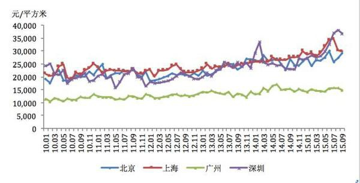
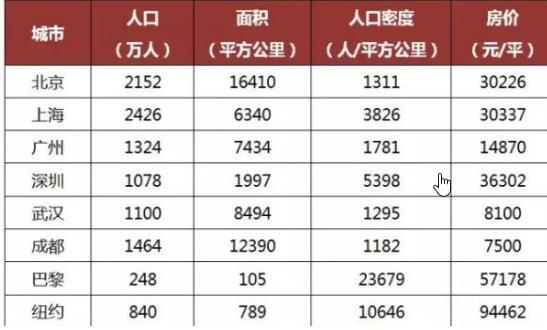
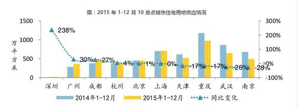
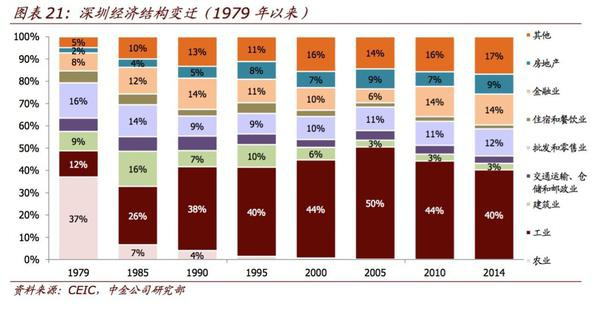
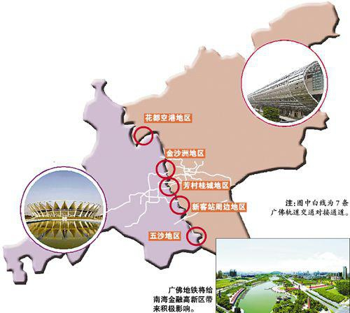

### [广深房价缘何差距加大？](https://zhuanlan.zhihu.com/p/21715156)
### 经济结构并不完全相似
深圳经济结构应该是以高新产业和金融为主，广州更多的应该偏向于贸易和制造业。
### 人口密度
广州7K余平方公里1.3K万人口，人均占地538.46㎡；深圳2K平方公里人口1.1k万，人均占地181.82㎡。两地人均占地差距3倍；
### 白领人均收入差距
广州6.9K/月，深圳7.7K/月，收入差距一成（注：白领以上的阶层才算购房人群，低收入阶层不能形成购买力）；
### 经济增速差距，
2016年上半年GDP同比增速广州8.0%，深圳8.6%；2015年广州人均GDP破2万美元，2014深圳人均GDP破2.4万美元。从这组数据我们也可以看出两地购买力差距之大；
### 地理位置
深圳紧邻香港，香港房价全球最高，故深圳也一定程度上受香港辐射；广州主城区紧临佛山南海，且南海不限购不限贷，故大量购买力流失至佛山，同时也拉低了广州的房价；
### 文化差异
广州人务实，投资风格偏保守；而深圳人都是外来闯天下的，投机风格更浓。
总的来说，广州是一座平和的多元化的特大型城市，不激烈，不张扬，不善营销，少谈长远大战略，更关注当下，关注生活，喜欢略保守地埋头干活，所以房价也平稳。深圳则是集全国怀揣同一个理想的精英，大家无时无刻不求发展，抢速度，论眼光，领潮流，做事风风火火，所以房价涨得快，波动大。

### [广州房价为何涨不过深圳](https://zhuanlan.zhihu.com/p/21453676)
广州房价涨不过北京上海，比较容易理解。一个是政治中心，一个是金融中心，集全国优质资源于一体，一纸户口都能被投机者炒到数十万元，更不用说房价。但广州房价涨不过深圳，原因到底是什么？还是值得探讨的。

北上广深的2010-2015年房价曲线图，深圳均价鹤立鸡群，而人家都不带广州玩▼

[在怎么看待现在广州的房价？](https://www.zhihu.com/question/19615246/answer/95805043) - 凯风的回答一文中，曾分析影响房价涨跌的几大因素：城区面积大小、土地供应多少、人口流入多寡、高端产业发展水平以及周边城市的居住替代效应。

正是这几大因素的存在，导致广州房价跑不过北京上海，也跑不过深圳。

#### 一 城区面积

##### 现实好比：把一座广州城的人，塞进那么小的深圳

首先，从城区面积上看，广州为7434平方公里，而深圳只有2020平方公里。说白了，广州有3.7个深圳那么大，土地供应量足，当然拉低了房价。

不过，单从城区面积去分析是有问题的。城市郊区仍有大量的农业用地存在，反映实际开发建设的建成区面积，可能是更好的指标。2015年广州建成区面积广州市建成区面积为1237.55平方公里，深圳建成区面积只有900平方公里。

万万没想到的是，在广州的城区面积和建成区面积分别是深圳的3.7倍和1.38倍的情况下，广州城市人口和深圳是旗鼓相当的。截至2015年底，广州常住人口1350.11万，深圳为1077.89万（官方数据，均有低估），前者只为后者的1.25倍，几乎是把广州一座城的人塞到那么小的一个深圳，大家还不打破头去买房挣个立足地？

看看深圳的人口密度，别人家的城市是1、3字头，它5字头……▼

#### 二 土地供应

##### 广州供应1年的住房用地，等于深圳5年

深圳城区面积狭小，发展用地不足，不仅为楼市高涨添上一把火，而且已经严重影响到深圳的未来发展。何况，深圳的土地供应濒临萎缩状态，而广州仍在不断加大土地投放力度，土地财政不断创出新高。

广州市2015年推出土地面积843万平方米，土地出让金收入954亿元，创造了历年土地出让收入的新高。对比深圳，2015年深圳土地出让面积仅有173.93万平方米，只有广州的1/5。

时间进入2016年，随着楼市调控政策加紧，悬殊更加明显。广州2016年计划供应总量约17.32平方公里，其中居住用地和商服用地合计8.81平方公里，广州比2015年实际供应量增加22%。反观深圳，根据最新公布的《深圳市住房建设规划（2016—2020）》，整个“十三五”期间，深圳市计划在5年内供应住房建设用地8平方公里，这个数字与广州1年的居住商服用地规模持平。

广州供应1年的住房用地，等于深圳5年。而深圳没买房的朋友，可以多看看此图。那空白的地方不是我PS掉的▼

深圳用地紧张早已不是新鲜事。深圳是新兴城市，又是国内首个没有农村的城市，与三旧改造基本无缘，与城中村改造同样无缘。用地紧张，深圳转向填海造地。数字显示，过去30年，深圳总共填海面积100平方公里，相当于1个半福田区；未来，深圳还将填海55平方公里。而香港在过去100年，总共填海面积也不过是76平方公里。

精卫填海，也是没有办法的办法。

#### 三 人口流入

##### 一个负增长，一个黄河入海流

最后说说人口。真正决定一个城市房价涨跌的根本因素在于人口流动，没有源源不断的人口流入，城市房价不会出现持久性的上涨。所以，人口流入多少，决定着房价的长期上升趋势。

在第一部分说了，2015年广州和深圳的常住人口分别是1350万、1078万。如果考虑到人口流动因素，两地的常住人口相差并不大，业界估计都在1500万以上。

然而，如果以环城高速为界，排除远郊和农业人口，仅从狭义的都市区来看，深圳都市区人口1063万人，而广州则为865万人。触目惊心的是，根据易居房地产研究院发布的《全国10大都市区人口与房价报告》，2010年之前，广州人口导入非常迅速，年均增长5.3%，而在2010年之后都市区人口年均出现负增长，增幅为-0.8%▼

广州的都市区人口年均出现负增长，对比之下，深圳常住人口在2000-2013年间增长了362万。目前深圳常住人口迅速增长，而外来人口占总比7成多。这些外来人口，不乏高层次人才，形成对房价的强力支撑。

#### 四产业结构

##### 深圳去年以来的暴涨，不是没有理由

如前所述，深圳的人口总量虽然不及广州，但深圳城区面积狭小、土地供应接近萎缩，导致房价供给上的紧张和短缺，供给紧张，而人口净流入却在不断增加，供需失衡，房价自然出现上涨。

但这些因素只能解释房价上涨，却解释不了深圳去年以来的暴涨。按照目前房价水平，深圳福田区普通住房的均价，已经与广州中心区的豪宅均价相当。

这种格局的出现，自然要从供需之外的因素来分析。产业结构就是其中的关键。一个城市有多少高收入人口，实质上可以决定这个城市房价高低。内蒙古的鄂尔多斯几乎没有外来人口流入，但本地的煤矿产业和高收入人群却能支撑起高房价，温州也是如此。

回到广州深圳，两地的GDP基本相当，但支柱性产业显然不一样。广州的三大支柱性产业是汽车制造业、电子产品制造业和石油化工制造业，这三大产业对于广州GDP的贡献超过50%，而深圳的四大支柱性产业分别是金融业、物流业、文化业和高新技术产业。

深圳经济结构变迁史，棕红色是工业，呈现下降趋势；而第三层淡橘色的金融业，势态良好▼

对比广州，深圳金融业和信息技术产业对于GDP贡献突出，金融业对深圳GDP的贡献率高达14.9%，广州的数据为9%；信息技术产业和互联网产业对于深圳GDP的贡献率高达22.5%。

金融业和互联网行业一直是高薪行业的代表。虽然高薪行业未必代表着房价高企，但没有高薪人员财力的支撑，显然不可能出现高房价，尤其在存在限购的情况下。

#### 五居住的替代效应
##### 感谢广佛同城，这么近又那么便宜

最后，来说说周边城市的居住替代效应。后台有不少读者指出，佛山为广州分流了大量购房人口，是非常正确的。

根据世行报告，无论是地域还是人口，珠三角已经超越东京成为世界第一大城市片区。广东是中国经济第一大省，而珠三角地区的GDP占广东78.9%，相当于全国生产总值的9.1%。珠三角经济发达，城市交流频繁，楼市的居住替代效应在这里也得到体现。

从广义上而言，广佛实质上已经连为一体。广州与佛山两市中心相距仅有30公里，黄岐等地更与荔湾区和白云区直接接壤，广州市民居住的金沙洲更是一分为二分别为广州和佛山所有。对比之下，广州远郊的增城从化南沙等地离市中心皆在60公里开外，虽然有户籍因素掣肘，但佛山已经成为广州市民的第一大居住地，其次是清远、东莞和中山。

广佛交界盘有这么多可选择的区域，购房客慢慢踱步都走不完▼

居住效应的存在，导致广州远郊房价远远落后于中心城区，反而广佛交界处的房价在不断上涨，在这种替代效应和平均效应的影响下，广州的高房价被均摊得低了下来。

其实深圳也有替代效应。但深圳与周边东莞和惠州市中心的距离分别在70公里和90公里左右，与深圳接壤的东莞凤岗镇到深圳市中心的距离也在30公里左右，加上城市轨道交通接驳尚不完善，居住替代效应远远比不上广州。

这也导致临深片区房价飞速上涨，远超广佛交界盘。这个“五一”，东莞凤岗镇推出的新房约2.2-2.3万元/㎡，而广佛交界楼大致在1.5—2万元/㎡。

我们得出三个结论
综上，广州房价为何涨不过深圳：

其一，从供给端来说，广州城区面积远远高于深圳，土地供应量更是遥遥领先于深圳，深圳土地储备几近萎缩，不得不靠填海造地，土地供给的萎缩必然造成住房供给的萎缩，从而在供给端上影响房价。

其二，从需求端来看，深圳经济增长强势，人口净流入增幅高于广州，而且深圳人口结构中外来占了7成以上，对住房需求更为强劲。加上深圳金融业和互联网行业发达，这两个公认的高薪行业的高收入群体，为房价上涨提供了坚强的支撑。

其三，居住替代效应。珠三角城市基本已经连为一体，广佛之间、深莞之间不仅形成良善的产业互补，更形成明显的居住替代效应。但广佛之间的城市距离更短，甚至远远少于广州市中心到增城从化南沙等远郊的距离，同时，广州荔湾区白云区等传统经济强区更是与佛山接壤，由此形成了庞大的广佛候鸟群体，在拉高佛山房价的同时，必然对广州的房价上涨形成抑制。
