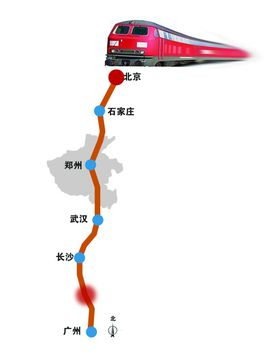
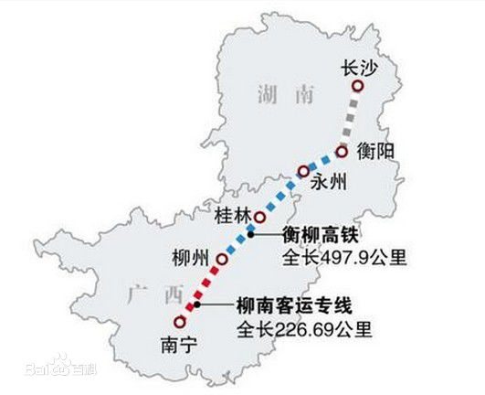
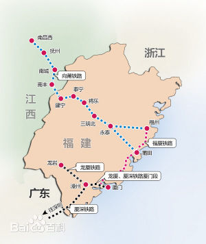
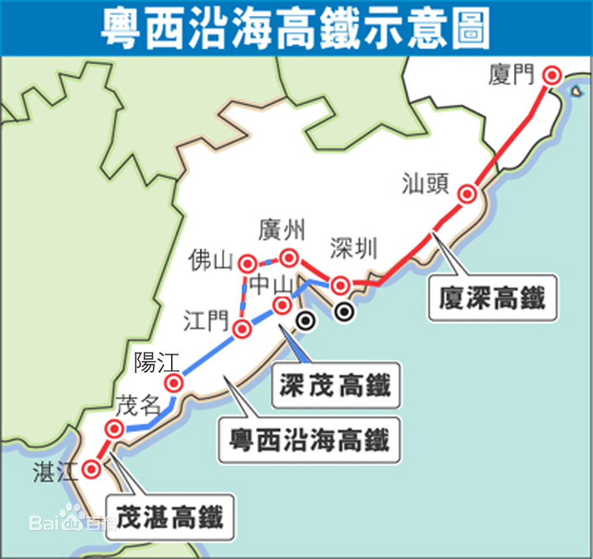

### 京广铁路
京广铁路连接五省一市，是贯通中国南北的重要铁路大通道，是国家铁路南北交通大动脉，也是中国铁路运输最为繁忙的主要干线，具有极其重要的战略地位。

### 广九线
### 衡柳铁路（2013年12月28日，GD）
2013年12月28日，衡柳铁路正式开通运营,高铁

### 昌福线
向莆铁路正式命名为昌福线、永莆线

### 深茂高速铁路
已于2014年5月底前先行动工建设，2014年6月底深茂铁路全线开工建设，整个工程计划建设工期为4年，预计可提前至2017年10月建成，2018年实现通车。

