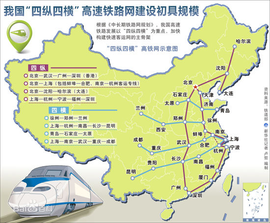
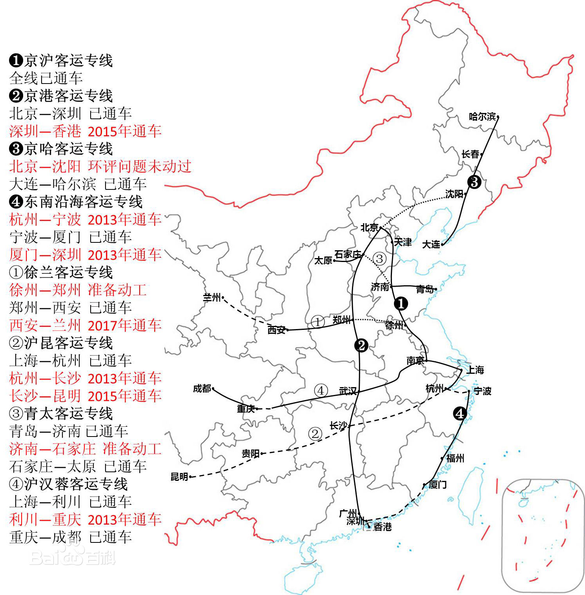
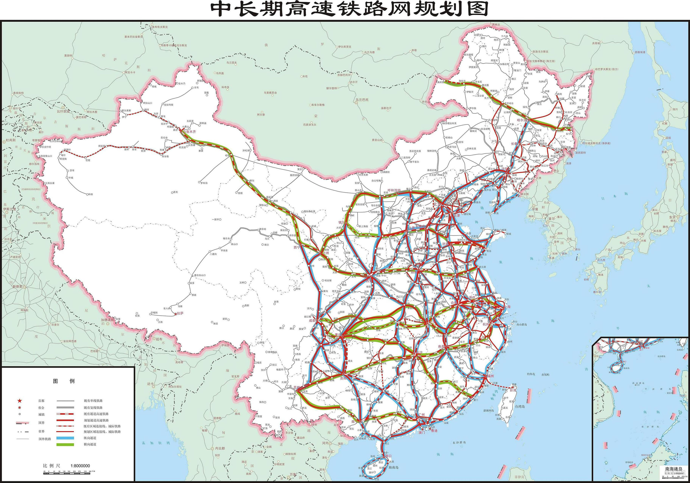

### 深圳北 到　抚州

|车次|D2322|	运行时间|	8小时43分|
|-----|-----|------|-----|
|始发站|	深圳北|	终点站|	南昌西|
|发车时间|	13:00	|到站时间	|21:43|
|动车类型|	动车组|	全程距离|	1202公里|

### 深圳北 到　永州
|车次|G6072|	运行时间|	3小时57分钟|
|-----|-----|------|-----|
|始发站|	深圳北|	终点站|永州|
|发车时间|	08:07|到站时间	|12:04|
|动车类型|	动车组|	全程距离|	686公里|

### 永州 到 南昌西
|车次|G2344|	运行时间|	3小时46分钟|
|-----|-----|------|-----|
|始发站|	永州|	终点站|南昌西|
|发车时间|	12:45|到站时间	|16:31|
|车次|G1502|运行时间|	3小时33分钟|
|发车时间|13:29|到站时间	|17:02|
|车次|G1504|运行时间|	3小时34分钟|
|发车时间|14:07|到站时间	|17:41|
|车次|G1506|运行时间|	3小时44分钟|
|发车时间|14:58|到站时间	|18:42|

### 长沙 到 抚州
|车次|D2606|	运行时间|	2小时41分钟|
|-----|-----|------|-----|
|始发站|	长沙南|	终点站|抚州|
|发车时间|	14:15|到站时间	|16:56|
|车次|D2602|运行时间|	2小时54分钟|
|发车时间|16:21|到站时间	|19:15|
### 京广铁路
京广铁路连接五省一市，是贯通中国南北的重要铁路大通道，是国家铁路南北交通大动脉，也是中国铁路运输最为繁忙的主要干线，具有极其重要的战略地位。

### 广九线
### 衡柳铁路（2013年12月28日，GD）
2013年12月28日，衡柳铁路正式开通运营,高铁

### 昌福线
向莆铁路正式命名为昌福线、永莆线.昌福线位于赣东和闽中地区，西起江西省南昌市，自南昌西站引出,分别引入外福铁路福州站和福厦铁路莆田站.

### 中长期铁路网规划
根据《中长期铁路网规划（2008年调整）》 ，中国将规划建设“四纵四横”客运专线，客车速度目标值达到每小时200公里以上

####  国家中长期铁路网、高铁网示意图（2016—2030 权威

### 京港客运专线
京港客运专线（京广-深港高铁）
途径主要站点：北京西站—石家庄站—郑州东站—武汉站—长沙南站—广州南站—深圳北站—香港西九龙站。京港客运专线由京石客运专线、石武客运专线、武广客运专线、广深港客运专线组成，连接华北、华中和华南地区，设计时速为350km/h。其中广深段于2011年12月26日开通，深港段预计于2018年Q3开通。
### 沪昆高速铁路
途径主要站点：上海虹桥站—杭州东站—南昌西站—长沙南站—贵阳北站—昆明南站
沪昆高速铁路由沪杭客运专线、杭长客运专线、长昆客运专线组成，连接华东、华中和西南地区，设计时速350km/h。
### 杭福深客运专线（东南沿海客运专线）
途径主要站点：杭州东站—宁波站—台州站－温州南站－福州站/福州南站－厦门北站－深圳北站，由杭甬客运专线、甬温铁路、温福铁路、福厦铁路及厦深铁路组成，连接长江三角洲、珠江三角洲和东南沿海地区。最新进展：高铁现已开通，深圳北站—上海虹桥站的D2286次于2013年12月28日9时55分从深圳北站始发，仅12小时17分即抵达上海虹桥。
### 深茂高速铁路
已于2014年5月底前先行动工建设，2014年6月底深茂铁路全线开工建设，整个工程计划建设工期为4年，预计可提前至2017年10月建成，2018年实现通车。

