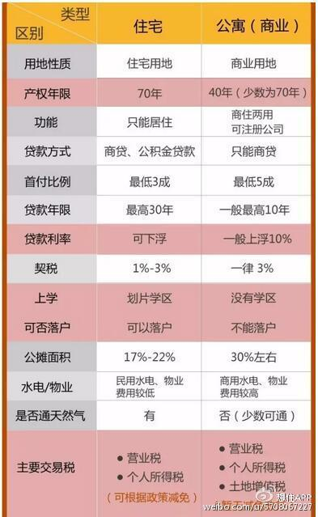
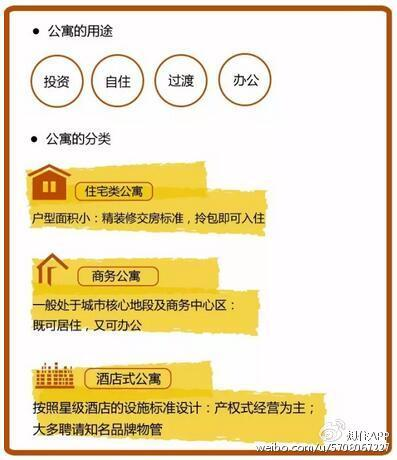

### 实用年限的不同
公寓和住宅规定的使用年限不同，一般而言，住宅年限是70年，公寓是50年。但公寓也有70年使用年限的。
### 建筑面积百分比不受限制
在中央商务区内，公寓的建筑面积占项目总住宅面积的比例不受限制；而普通住宅的建筑面积与总住宅面积的比是有限制要求的。
### 公寓的日照条件比住宅差
按照《住宅建筑设计规范》的有关规定，居住产品中的住宅，必须满足日照、采光等相关条件。而公寓则不一定，因此同一幢楼中公寓的日照条件比住宅差。
### 水电费计算不同
公寓楼水电费按商用计算，而普通住宅的水电费按民用算。
### 公寓不能落户
公寓如果实在商业用地上建起的项目，是商业性质，就不能落户。如果是在住宅用地上建起的满足一定条件，比如60平以上，根据不同地区的要求不同，有些地方也是可以落户的。
### 产权证的用途栏登记不同
监管部门对公寓进行房屋产权登记时必须明确为“公寓”，并在房屋产权证上的房屋用途一栏标注为“公寓”。

### 公寓不享受就近入学
在很多地区，公寓性质的住宅是不能成为学区房的，也就是说不能让孩子就近入学。
### 选住宅时
```
产权性质:商品房
住宅类别:普通住宅
朝向:南北
楼层:10~20
年代:
学校:
```
