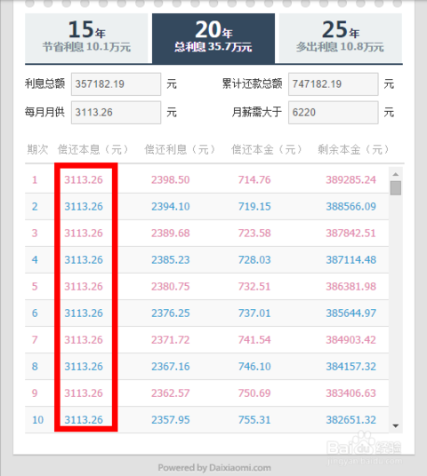
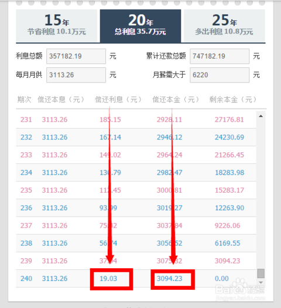
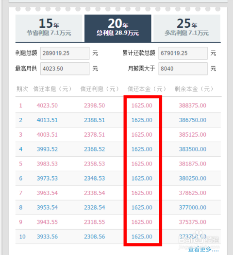
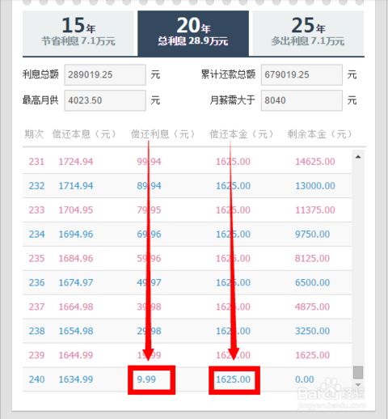

### 贷款条件
- 1.只有参加住房公积金制度的职工才有资格申请住房公积金贷款，没有参加住房公积金制度的职工就不能申请住房公积金贷款。
- 2.参加住房公积金制度者要申请住房公积金个人购房贷款还必须符合以下条件：即申请贷款前连续缴存住房公积金的时间不少于六个月。因为，如果职工缴存住房公积金的行为不正常，时断时续，说明其收入不稳定，发放贷款后容易产生风险。
- 3.配偶一方申请了住房公积金贷款，在其未还清贷款本息之前，配偶双方均不能再获得住房公积金贷款。因为，住房公积金贷款是满足职工家庭住房基本需求时提供的金融支持，是一种"住房保障型"的金融支持。
- 4.贷款申请人在提出住房公积金贷款申请时，除必须具有较稳定的经济收入和偿还贷款的能力外，没有尚未还清的数额较大、可能影响住房公积金贷款偿还能力的其他债务。当职工有其他债务缠身时，再给予住房公积金贷款，风险就很大，违背了住房公积金安全运作的原则。
### 贷款额度
- 1.大部分城市都规定了单笔住房公积金贷款的最高额度,广州市住房公积金贷款个人最高额度为50万元，申请人为两个或两个以上的最高额度为80万元。
- 2.住房公积金贷款额度最高不超过房款总额的70%；
- 3.申请公积金贷款还应满足月还款/月收入不大于50%（其中：月还款包括已有负债和本次负债每月还款之和）
- 4.深圳最高贷款90万
### 没有正常状态的联名卡,不能登录
- 需要先去银行激活
- 激活后，登录住房公积金提取的网站
- 登陆时密码默认为你身份证后6位，不是发卡时的密码

### 还款方式中等额本息与等额本金的区别
##### [等额本金和等额本息最直观的区别](http://jingyan.baidu.com/article/948f5924048c77d80ef5f945.html)
##### 拿第一种还款方式来说，贷款39万，每月的还款明细如下：

可见等额本息法，每个月的还款额度是相同的，但是本金还的较少，利息还的较多。
我们来看，还款到最后一个月的时候的情况，最后一个月利息还了19块钱，但是本金还了3000多，也就是说以这种还款方式，前期还的都是利息，等你十年后想要一次性付清的时候，发现你的本金根本都没还多少。

##### 再来看第二种方式，同样是贷款39万，每月的还款明细如下：

等额本金法,这种方式还的我们每个月还款的金额在逐渐递减，第一个月压力较大，第一个月压力较大，但是仔细看，我们每月还的本金是一样的，也就是我们的本金在银行越来越少，越来越少，下面我们看最后一个月的时候还款情况：

