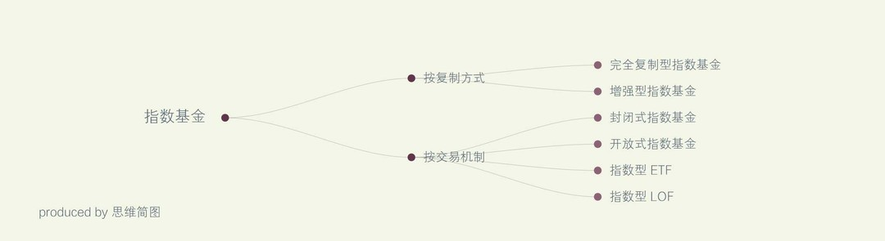

### [你的基金要补仓么？——指数基金篇](http://www.jianshu.com/p/b056dd6ba410)

>坚持学习，坚持分享

最近股市跌跌涨涨，真没让人省心的一天。

按照我之前的逻辑，牛市买股，熊市买基。但是这句话也有一个前提，在明确股市还有未来上涨确认市牛的情况下买股，单边下跌市一定不能买基，而且要停止定投基金，将基金赎回。

举个例子，去年股市从5月份5100点跌到今年1月份2638点，整个半年多都是一直单边下跌，这时候要是五月份每个月定投买基金那你一定会亏死，因为在下跌未见底部的时候怎么买都是亏损的，因为未来还有下跌空间。只有市场到了底部位置，未来股指只会向上走，不会再低过某个点了，那此时可以开始建仓起投了。结论就是在单边下跌市中要停止基金定投（包括股票型，混合型，指数型）

那今天给大家介绍一下什么是指数基金，指数基金怎么玩？最近要不要补仓。

#### 一，什么是指数基金

指数基金(Index Fund)，就是以特定指数(如沪深300指数、标普500指数、纳斯达克100指数、日经225指数等)为标的指数，并以该指数的成份股为投资对象，通过购买该指数的全部或部分成份股构建投资组合，以追踪标的指数表现的基金产品。通常而言，指数基金以减小跟踪误差为目的，使投资组合的变动趋势与标的指数相一致，以取得与标的指数大致相同的收益率。

#### 二，指数基金分类

如下图所示，大概知道就行了

>指数基金分类

#### 按复制方式

* 完全复制型指数基金：力求按照基准指数的成分和权重进行配置，以最大限度地减小跟踪误差为目标。

* 增强型指数基金：在将大部分资产按照基准指数权重配置的基础上，也用一部分资产进行积极的投资。其目标为在紧密跟踪基准指数的同时获得高于基准指数的收益。

#### 按交易机制划

* 封闭式指数基金：可以在二级市场交易，但是不能申购和赎回。

* 开放式指数基金：它不能在二级市场交易，但可以向基金公司申购和赎回。

* 指数型ETF：可以在二级市场交易，也可以申购、赎回，但申购、赎回必须采用组合证券的形式。

* 指数型LOF：既可以在二级市场交易，也可以申购、赎回。

大概先了解下，具体的ETF和LOF的区别我以后单独说。

#### 三，指数基金特点

##### 1、费用低廉。

这是指数基金最突出的优势，费用优势主要体现在购买费用和管理费上。由于指数基金采取持有策略，不用经常更换，这些费用远远低于积极管理的基金，这个差异有时达到了1%-3%，虽然从绝对额上看这是一个很小的数字，但是由于复利效应的存在，在一个较长的时期里累积的结果将对基金收益产生巨大影响。

##### 2，分散和防范风险

目前国内指数基金可选择品种很多，而且单一指数基金广泛地分散投资，任何单个股票的波动都不会对指数基金的整体表现构成太大影响，能有效分散风险。,

##### 3，长期成长性好

由于指数基金属于被动跟踪管理，投资者只需考虑市场中长期趋势和指数标的匹配性，其不会受到主动型基金投资人的操作风格、投资偏好、人员变动等不确定因素的影响，在投资的长跑中更容易胜出。

#### 四，指数基金选择方式：

第一，选指数，即投资者想投资的指数，不同市场的代表指数或不同主题板块的指数基金，对于想通过指数进行长期投资的投资者来说，投资方法可选择定期定投，可选择代表性强的主流指数基金；当然选择时候也包括了基金公司的实力。

第二，看费率，总体上看ETF和指数LOF的费率水平较低；相对于主动管理型基金，指数基金的优势之一就是费用低廉，但不同指数基金费用"低廉"的程度却有所不同，尽量减少投资成本是非常必要的。当然，应注意的是，较低的费用固然重要，但前提是基金的良好收益，切勿片面追求较低费用而盲目选择指数基金。

第三，看指数拟合度；不同指数覆盖的市场范围不同，其风险收益特征也不同，如上证180和深证100指数，分别反映沪深两市的情况;中证100和中小板指数，则分别反映沪深两市企业大盘蓝筹与中小企业的情况;甚至随着跨境ETF的推出，同时选择沪深300指数基金与投资海外市场指数的基金，也是很好的资产配置方向，能够在一定程度上起到分散投资、分散风险的作用。

第四，看交易成本和便利性。对于投资者来说购买指数基金可以有两个渠道：一是通过自己的开户银行或者基金公司等网站购买指数基金；二是通过股票账户在二级市场购买指数基金。后者仅限于购买在交易所上市的指数基金如指数LOF和ETF。

#### 五，指数基金现状：

我在2016年4月27日看到的信息，27日，华宸未来沪深300指数增强型发起式证券投资基金(LOF)(以下简称“华宸300”，代码167901)因规模低于2亿元进入清算程序。事实上，从去年以来基金清盘在市场上就屡见不鲜，记者统计发现，截至一季末，54只偏股基金和81只指数型基金也跌破5000万清盘红线，清盘压力较大。（中国基金报）

按照基金运作管理办法，发起式如果成立的第3年年末资产规模低于2亿元，则面临清盘。

华宸300也在公告中称，截至2016年4月26日日终，华宸300的基金资产净值低于2 亿元，基金合同将自动终止。

根据一季报披露，华宸300期末净资产为0.1604亿元，2015年年报显示持有人户数为290户，其中个人持有比例为18.56%。前十名持有人中，9名为个人投资者。

事实上，这并非发起式基金自动终止的先例，就在上个月，华夏基金旗下的华夏材料ETF(510620)和华夏能源ETF(510610)两只基金也启动清盘。

而在A股持续低迷的大环境下，根据一季度统计数据显示，偏股混合性基金和指数基金将成为清盘重灾区。此外，QDII基金因近两年净值表现差强人意，规模缩水也较为严重，迷你基金数量较多。

数据显示，截止3月31日，和长期纯债基金、QDII基金、股票型基金等几种类型相比，被动指数基金(不同份额合并计算)中迷你基金数量最多，有81只基金规模低于5000万清盘红线，其中有7只规模甚至不足千万，36只基金为2015年以来成立的次新基金。

面临清盘的指数基金
总的来说，指数基金也是存在风险的，特别是目前指数基金那么多，挑选一只好基金的难度不亚于选股票，大家要擦亮眼睛选择哦。但是在大盘牛市来时，指数基金的收益也是相对不错的，布局指数基金也会成为防止踏空同时规避波动的收益“利器”。

举个例子：3月份截止3月21号时候的统计情况：创业板指数3月以来涨17.72%，大幅领先上证50、沪深300以及中证500指数。创业板指数基金表现抢眼，平均涨幅超过18%。7只创业板指数基金中有两只涨幅超过20%，分别为鹏华创业板、融通创业板；两只超过19%，其余3只超过18%，涨幅最高为20.54%，最低为18.86%。追踪中小盘中证500的29只指数基金中有20只跑赢指数，建信中证500指数涨幅最高，达到17.14%，同期中证500指数涨13.4%。这些在当时看收益还是挺不错的。在市场底部或指数底部，如果坚持看多指数在未来长期能不断上涨，选择好的指数基金投资，在牛市来时能获得不错的收益。

#### Q&A 买基金要买价格高的还是价格低的？

有朋友问我：我从大家推荐的基金里买价格便宜的，一块上下，就是赔也赔不了多少有道理吗？”

然后我回答：没有道理。

这是为什么呢，大家犯了一个常识性的错误，容易依赖自己的主观感受。

假设你1000块（暂且忽略手续费）,净值5块的基金，你可以买200份， 净值2块的基金，你可以买500份，次日，都下跌了2%，5块的基金，每份变为4.9元，200份总的剩余980元， 2块的基金，每份1.96元500份，总的还是980元，是一样的，所以你觉得便宜的赔也赔不了多少的想法是错误的，是你直观的感受，没有去计算。因为你购买时候是定投一定金额的，所以没有差别

就像买股票一样，我一朋友，7块的股票，本来就很低了价格，相比一百多块一只的股票，但是遇到暴跌还是跌到了3块钱一只，该亏损的还是会亏损，反而低价股里散户多，因为大家都觉得便宜，风险小。

文／jessica夜（简书作者）
原文链接：http://www.jianshu.com/p/b056dd6ba410
著作权归作者所有，转载请联系作者获得授权，并标注“简书作者”。
