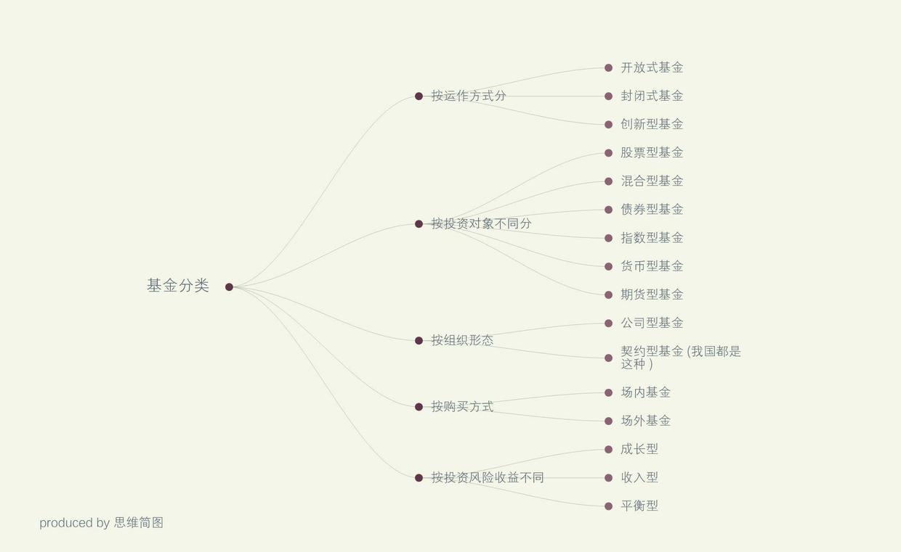

### [我的买基史 ，基金攻略（一）](http://www.jianshu.com/p/7dedf9dbcfb1)

先说下我的买基史，14年毕业工作，那时候工资一个月4000，税保险公积金700，房租水电1000，吃饭1000，社交娱乐500，剩下800，女孩子嘛，啥都得花钱，各种不够花，月光族，各种都想买，工作前半年月月光，不要笑我，我相信很多人刚开始工作和我一样。快过年了，得回家吧，可是工作半年，真是什么钱都没存下来，过节回家只给爸妈一人600块，实在是拿不出手，爸妈回我了888，希望我工作顺利。年后回去痛定思痛，不能这样了，明年得给爸妈多点钱了，要多存钱，于是各方了解后，银行存款余额宝利息比较低，其他投资门槛又高，综合了下，强制每个月拿一部分出来买基金定投。

2015年4月开始我的买基史，挑了一只汇添富移动互联，股票型基金（场外基金），比较看好移动互联网的发展嘛，当时也没怎么看各种信息，就买了，定投两月，6月股市大跌，基金开始狂跌，我马上停了该基金定投，这一跌就是大半年，刚买的基金折了一半~此外，我一直有用私房钱（上学时候，打工存的）炒股，15上半年别人推荐了富国基金的移动互联B，军工B（场内基金），分级基金，我就买了，一开始赚了很多啊，本金加收益到1W的样子了，6月股市暴跌开始，当时工作又忙，没时间管，每天都跌停，根本卖不出去，最后引发下折，损失80%，1W只剩下两千多，只好扔那了。

这就是我的基金血泪史，这里的提到的两种基金是不一样的，之后我给大家介绍一下。当然除了这两只基金，我又陆续购买了其他类型的基金做投资，也在学一些基金的挑选方式，和大家分享一下。首先要了解基金有些啥，现在市场上几千只基金，挑的都眼花缭乱了。

#### 一、基金的基本概念

基金：基金是指为了某种目的而设立的具有一定数量的资金。这里主要指证券投资基金。基金管理公司通过发行基金单位，集中投资者的资金，由基金托管人（即具有资格的银行）托管，由基金管理人管理和运用资金，从事股票、债券等金融工具投资，然后共担投资风险、分享收益。

（好了，简单说就是很多人把钱交给基金管理人集中操作，他把钱拿来买股票，买债券，赚了一起分钱，亏了也一起亏钱。因为通常基金管理者有专业知识背景和技术工具，能更好的投资获取收益回报。风险相对小于股票投资）

基金净值：当前的基金总净资产除以基金总份额。基金净值=总资产/基金份额

#### 二、基金分类

看到资料上写的实在太多了，就想让大家能直观的看出有些啥，归纳，做了一张图。

基金分类
其他常见的一些名词给大家解释下：

`对冲基金：HedgeFund，意为“风险对冲基金”`，起源于50年代初美国，当时的操作宗旨是利用期货、期权等金融衍生产品以及对相关联的不同股票进行实买空卖、风险对冲操作技巧一定程度上可规避和化解投资风险。举个例子：在一个最基本的对冲操作中,基金管理人在购入一种股票后，同时购入这种股票的一定价位和时效的看跌期权。看跌期权的效用在于当股票价位跌破期权限定的价格时，卖方期权的持有者可将手中持有的股票以期权限定的价格卖出，从而使股票跌价的风险得到对冲。经过时间演变对冲基金已成为一种新的投资模式的代名词，即基于最新的投资理论和极其复杂的金融市场操作技巧，充分利用各种金融衍生产品的杠杆效用，承担高风险，追求高收益的投资模式。

`QDII基金：是QualifiedDomesticInstitutionalInvestor(合格的境内机构投资者)的首字缩写。`它是在一国境内设立，经该国有关部门批准从事境外证券市场的股票、债券等有价证券业务的证券投资基金。由国内基金管理人管理或香港基金管理人管理，内地投资者无需经过繁杂手续投资海外市场。如：广发纳斯达克100指数（000274），鹏华全球高收益债券（000290）等。（举例子随便挑的不构成投资建议哦，我没买哦）

`ETF基金：是ExchangeTradedFund的英文缩写，中译为“交易型开放式指数基金”，又称交易所交易基金。`ETF是一种在交易所上市交易的开放式证券投资基金产品，交易手续与股票完全相同。ETF的投资组合通常完全复制标的指数，其净值表现与盯住的特定指数高度一致。比如上证50ETF的净值表现就与上证50指数的涨跌高度一致。如深证中小板ETF(159902)，主要投资于深圳中小板指数成份股、备选成份股。

`LOF基金：开放式基金（LOF）`，英文全称是“ListedOpen-EndedFund”或“open-endfunds”，汉语称为“上市型开放式基金”，在国外又称共同基金。也就是上市型开放式基金发行结束后，投资者既可以在指定网点申购与赎回基金份额，也可以在交易所买卖该基金。

其他不懂的还可以自行百度哟~

各种类型的基金风险和收益从大到小依次为:

#### 股票型基金>混合型基金>债券型基金>货币型基金

风险越高，收益越高。当然具体的如分级基金带杠杆的风险也会更大，亏损起来也会更多，之后给大家分开来讲每一种的差别。

#### 三，场外基金的认购，申购和赎回

为什么说场外呢，因为场内基金的购买和赎回和买卖股票一样，直接在股票市场里可以进行买卖，今天买进，明天卖出都行，完全和股票买卖方式一致。

`认购`：只有新基金才有认购，新发行一个基金有一段募集期，在这期间购买该基金的行为叫做认购，并且手续费相对较低，有一定的优惠。

`申购`：就是申请购买基金份额，募集期之外的购买该基金的行为，手续费相对较高。

`赎回`：就是将手中的基金卖掉，换回现金。

基金定投我们一般指的场外基金，那在哪里可以买基呢？

以前一般要在银行或基金公司开户才行，现在很方便，只要通过一些基金平台的手机app上就能购买了，自行搜索下载。

四、选基金的标准

这是一个比较复杂的问题，选基金跟选股票一样，需要看这只基是否质地优良，有良好的成长空间，但这些判断的标准需要综合去看，一般要看：

#### 1，基金公司实力

#### 2，基金经理实力和能力

#### 3，基金历史业绩，基金评级

#### 4，基金投资标的，所属板块，未来发展趋势，政策支持等情况

举例子：因为我国之后会逐步进入人口老龄化，对于养老医疗的需求就会加大，我就比较看好医疗板块，然后从这个板块里看有那些基金，再根据基金公司实力，基金经理过往业绩，能力等综合评估来看选择一只基金，长期持有，然后开始定投，每月发工资就拿出500买这只基金。

#### 五，基金的买卖时间

俗话说：牛市买股，熊市买基。现在是一个慢牛，或政策牛，股市点位不算高，所以比较适合买基金，进行基金定投。以期在未来牛市获得更高收益。

如果说一只基金的净值长期来看是不断提升的，那么严格意义上就没有准确的买点和卖点，任何时候买都是正确的，因为未来他是不断成长的。但是短期内，因为股市影响，使得基金净值每天会受到影响而上下波动，所以就出现了价格高低的差别。当然`最好的方式就是跌的时候买买买，高的时候卖出。`定投是针对没有时间的个人，每月或每周自动划出一笔钱来定投，从长期内平衡风险，获得收益, 对于有的人来说也算是一种强制储蓄的方式。

我觉得我可以写个基金系列了，因为我也是一边在学习，一边给大家分享，所以我具体的再之后再分享好啦。

文／jessica夜（简书作者）
原文链接：http://www.jianshu.com/p/7dedf9dbcfb1
著作权归作者所有，转载请联系作者获得授权，并标注“简书作者”。
