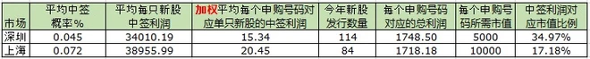

### [持股打新，你值得拥有](https://xueqiu.com/2466194910/79052603)

新股申购制度改革后，持股打新成为一种新的盈利模式。但是打新股的年化收益率是多少，还需要用数据说话。

今天从东方财富网站下载了新规后发行的所有新股数据，这些数据包括了每只新股的中签率以及相应的中签利润。剔出掉还没有开板的部分的新股，总计新股数量是：深圳114支，上海84支。

加权平均每个申购号码对应单只新股的中签利润：深圳15.34元、上海20.45元 （加权平均：根据每只新股的中签率和中签利润，计算出每个申购号码对应每一只新股的利润，然后把所有单只新股对应的利润加总再除以新股数量。这个计算方式可以避免因为大盘股中签率高，因导致虚增中签利润的影响）。

然后根据今年发行的新股数量，可以计算出每个申购号码所对应的新股中签总利润为：深圳：1748元，上海：1718元。中签利润与持股市值比例为：深圳：34.97%，上海：17.18%。持股打新的收益率完全超出了我自己毛估估的5%-10% （可能是因为我今年新股中签太少）。当然这只是理论上的收益率，要达到这个收益率，需要开N个不同名账户，每个账户配置深圳股票5000元和上海股票10000元。

假设新股发行速度和中签利润保持不变，我们可以得出以下结论：

1. 持股打新是小资金投资者的一种不错的盈利模式，可以获得非常满意的年化收益率。

2. 持股打新会对低估值大蓝筹产生非常大的需求，甚至起到价值重估的作用，特别是深圳的低估值蓝筹。

3. 深圳新股中顶格申购限额在1万股以上的总共89只，占比为78%。10万元以下的账户，建议满舱全部配置深圳，浪费不了多少配售市值。不要配置上海股票，也不用做仓位管理。

4. 上海新股中顶格申购限额在1.5万股以上的总共53只，占比63%。25万元以下的账户，建议配置10万元深圳股票，剩下的钱全部满仓配置上海股票，不用做仓位管理。

5. 超过25万元的账户，尽可能多开几个不同名账户，越多越好。尽量不浪费每一分钱市值。

作者：中庸之道的投资者
链接：https://xueqiu.com/2466194910/79052603
来源：雪球
著作权归作者所有。商业转载请联系作者获得授权，非商业转载请注明出处。
