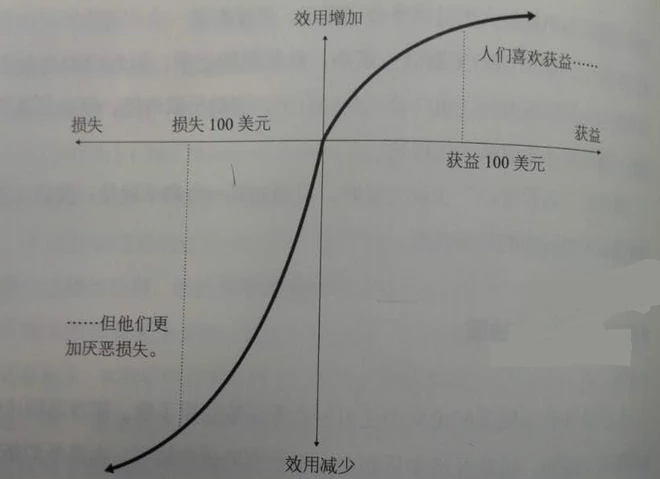

https://xueqiu.com/1091244780/78924566

《错误的行为》作者是美国很有名的一位行为经济学学者，理查德·泰勒

里面的很多内容深深打动了我，比如这张图：

这张图是行为经济学一个很新的成果，相比以前的财富边际效用递减理论，这个新模型能更好地描述人们的行为，蕴含了大量有关人类本性的智慧

它主要体现了以下3点信息：

1、曲线的上半部分代表获益，与一般的财富效用曲线相同，体现了敏感性递减的规律。

比如：一个年薪50万的人从地上捡到1万元所获得的快乐，与一个年薪3万的人从地上捡到1万所获得的快乐是不同的，后者心理冲击更大。

2、与传统经济学边际理论不同，这个模型存在一个零点，且曲线下方的损失部分也符合敏感性递减规律。

比如：一个人某天打麻将输了5万，这时他在5万的基础上又输500时，与他输第一个500时带来的心理感知是完全不同的，后者心理冲击更大。

3、对于大多数人，比起收益，他们更厌恶损失。损失带来的效用往往两倍于同等数量的收益。

损失厌恶是行为经济学很有名的观点了。书中引用了很经典的一个案例，一组对比实验。

当人们被问及问题1：如果你有一个赚100美元的机会，你会选择以下哪个选项？

A)100%可以得到100美元 。 【72%】

B)50%得到200美元，50%什么都没有。 【28%】

当人们被问及问题2：如果你一定会损失100美元，你会选择哪个选项？

A)100%损失100美元。【36%】

B)50%机会损失200美元，50%一分钱不损失。【64%】

书里还有很棒的一个例子：

一个中产家庭的妻子，有自己的工作，收入不错，有一次抱怨修建自家草坪的工作太烦太累了，朋友问她：“为什么不花10美元请一个孩子给自家修剪？”

这位妻子觉得为了这些工作付出这些钱不值得。

但朋友换了一种说法：“如果有人愿意花20美元雇佣你给他家修剪草坪，你愿意吗？”

“不愿意”

所以，当人们面对同样数额的“付出”和“收获”，心里得到的感受是不等的。

四

当我读到《错误的行为》这个章节时，我脑中就不停联想到股市中大家的行为，深感对作者人类本性观察的认同。比如我想到了：

1、`为什么那些没经过特殊投资训练的新股民，往往会本能地倾向于选择短线交易？`

因为：根据收益效用递减，用10万的本金，赚10次1万所带来的快感，要远比用10万，赚1次10万更爽。当时我还联想到，连我妈这种股场老兵，为什么也依然沉浸在每天能赚出一顿饭钱的那种快感中，如果不经过特殊的有意识的学习和训练，人的这种本能很难克服。

同时，买入一个股票时，从0收益到10%收益的过程，要远比从盈利90%到盈利100%的这个过程更刺激更爽。解释了为什么新投资者总是赚10%~20%就忍不住获利了结，寻求新的目标，因为从0到10%这个过程是最爽最刺激的。

2、`为什么那些没经过特殊训练的新股民，总是小亏时不止损，到大亏时直接躺地上装死？`

止盈不止损是新股民很明显的一个特点，而大部分股民入市第一轮牛熊，都是以小亏补仓，爆亏装死为结局的。

看到这书时我也找到了解释，相比用10万赚到1万而言，10万亏了1万带来的不爽更大，这个时候人本能地潜意识里不愿意承认这种损失，希望翻本，结果是往往选择补仓而不是止损。与赚钱时的止盈心态一样，亏钱时不止损也是人类的一种本能。

同时，相比10万从0收益到-1万的过程而言，从亏7万到亏8万的这个-1万，带给人们的刺激要小了很多，这也是为什么当大熊市暴跌，人们爆亏后，反而容易坦然面对市场波动，不再受市场折磨，躺地上装死。

五

很多时候觉得自己不只是要学会如何作为一个经济学意义上的理性人去分析市场，能够从人的本能角度去理解市场，学习教训也很有意思，同时也很有收获。
