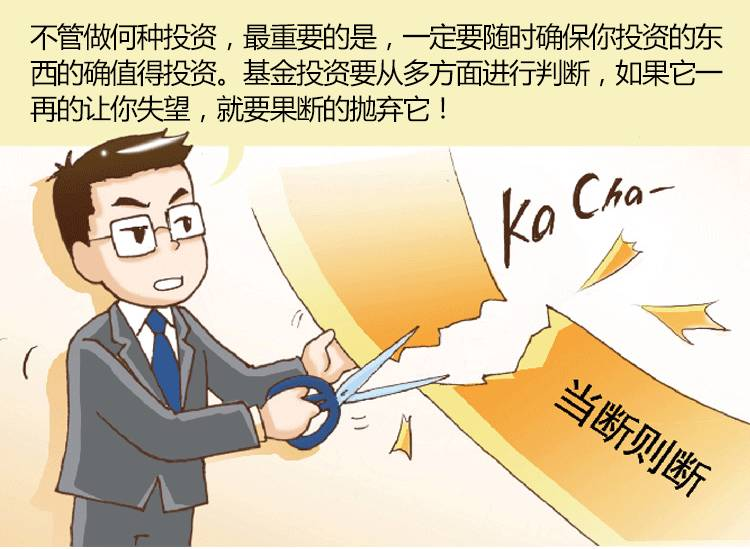

### [【兴全养基笔记】学会“聪明”地面对亏损！](http://www.weixinla.com/document/77528933.html)
市场的起伏有着无法预测的随机性，即使是专业的投资大师们，也难以保证投资策略的万无一失。面对投资失利，有的投资者采用“鸵鸟”策略，视而不见，顺其自然；有的投资者选择低位补仓，摊薄成本；而有些投资者则勇于承认错误，割肉离场。到底什么样的态度才称得上是一个“聪明投资者”应有的呢？
兴全养基笔记——关于基金理财的点点滴滴
读一读，或许会有所收获哦！

