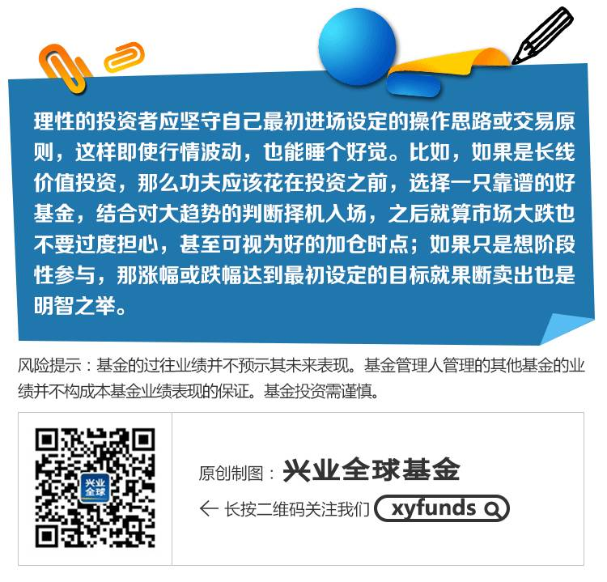

### [【兴全养基笔记】神秘的时点！买卖基金的最佳时机](https://m.antfortune.com/fd-ijphjmcw/share-viewpoint.html?topicId=2088221016867379&commentId=2016070701900000326903&topicType=PERSONAL)

基金投资，最关键莫过于两个问题，
#### 其一是买什么，
#### 其二是什么时候买什么时候卖。
但是“择基”和“择时”从来就不是轻而易举的事。
相较起来，后一个问题带给基民的困扰丝毫不小于第一个。
`我们当然都希望能买在最低点，卖在最高点。`
但事实上，这种神秘的时点，即使存在，至少也是极难捕捉的。

#### 兴全养基笔记——关于基金理财的点点滴滴
读一读，或许会有所收获哦！

