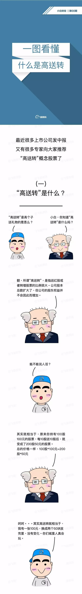
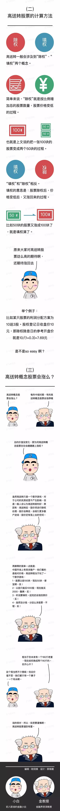

### [高送转股票](http://baike.baidu.com/item/%E9%AB%98%E9%80%81%E8%BD%AC%E8%82%A1%E7%A5%A8)

高送转股票（简称：高送转）是指送红股或者转增股票的比例很大。实质是股东权益的内部结构调整，对净资产收益率没有影响，对公司的盈利能力也并没有任何实质性影响。
“高送转”后，公司股本总数虽然扩大了，但公司的股东权益并不会因此而增加。

#### 合理投资回报
上市公司究竟在多大程度上进行利润分配，才能代表合理的投资回报？这一问题要具体问题具体分析，但企图通过“高送转”吸引投资者，或采取“分光吃光”甚至“寅吃卯粮”的做法，很可能会阻碍公司未来的发展。因此，股利分配固然是上市公司回报投资者的一种极为重要的方式，但并不是唯一的方式。上市公司只有根据实际发展状况制定合理的股利分配方案，而不是盲目分配、恶意分配，才是实现企业健康、长远发展和回馈投资者的最好方式。而作为投资者，`只有树立价值投资理念，重点关注公司的盈利能力和成长性，才能有效避免跌入“高送转”种种陷阱中。`

>高送转里面的几件事：高、送、转、派
高：每10股送转数字在5以上就叫高送转
送：用未分配利润送股
转：公积金转股
派：派发现金
按F10看财务分析，未分配利润和公积金数值越高，该股票越有送转的能力。

